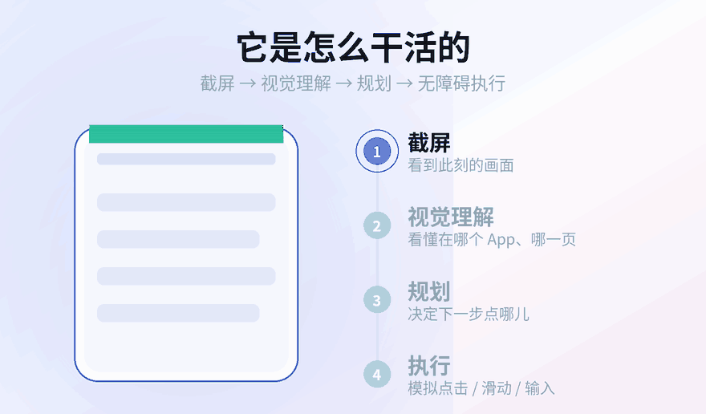
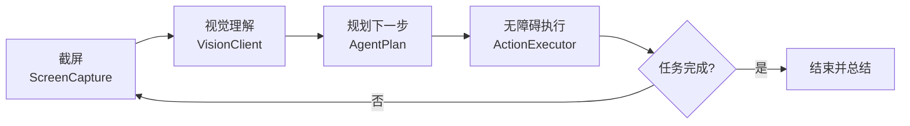
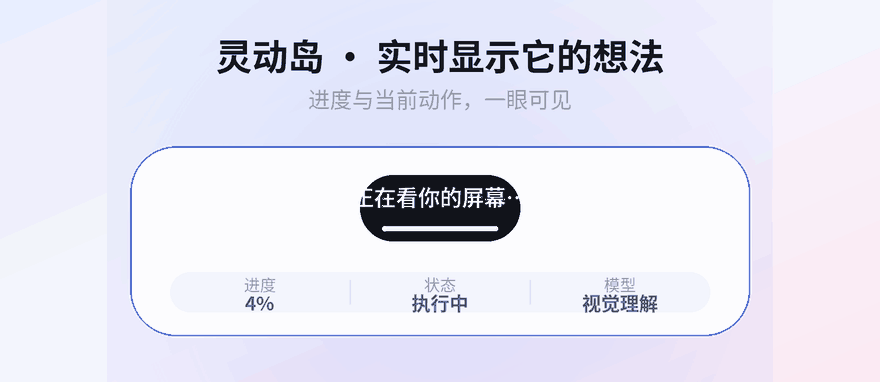

<div align="center">


<br />


# Orion

**通用 AI 手机操作助手 · 说一句话，它替你操作手机**

[](https://www.android.com/)
[](https://kotlinlang.org/)
[](https://developer.android.com/jetpack/compose)
[](LICENSE)
[](https://github.com/XIAWAN-PROMAX/Orion/releases)

</div>

***

## 目录

- [这是什么](#这是什么)
- [它能做什么](#它能做什么)
- [它是怎么干活的](#它是怎么干活的)
- [灵动岛：实时显示它的想法](#灵动岛实时显示它的想法)
- [智能节奏：自己拿捏快慢](#智能节奏自己拿捏快慢)
- [自学习：越用越顺手](#自学习越用越顺手)
- [支持的动作](#支持的动作)
- [下载安装](#下载安装)
- [快速开始](#快速开始)
- [支持的模型](#支持的模型)
- [常见问题解决](#常见问题解决)
- [隐私与安全](#隐私与安全)
- [技术栈](#技术栈)
- [项目结构](#项目结构)
- [更新日志](#更新日志)
- [注意事项](#注意事项)
- [许可证](#许可证)

***

## 这是什么

Orion 把手机变成会自己动手的助手。

你只需要说一句话，它就能**看懂屏幕、想清楚下一步、再模拟真实的点击与滑动**，一步一步把事做完。

它的思路很朴素，就像一个人在用手机：**看一眼 → 想一想 → 动一下 → 再看一眼**。循环往复，直到任务完成。

> 例：*「打开美团，搜一下附近评分最高的川菜馆」* —— 剩下的交给 Orion。

***

## 它能做什么

| 能力     | 说明                                                                 |
| ------ | ------------------------------------------------------------------ |
| 看懂屏幕   | 截图交给多模态大模型，识别当前是哪个 App、哪一页、该点哪里                                    |
| 替你动手   | 通过无障碍服务执行点击、长按、滑动、滚动、文字输入、返回 / 回桌面 / 多任务                           |
| 实时解说   | 每一步的「想法」和进度，实时显示在灵动岛（实况通知）上                                        |
| 随时可控   | 一键暂停 / 停止，停止立即生效；碰到付款、下单等操作会先停下来问你                                 |
| 模型可换   | 内置豆包视觉、Qwen-VL，也支持任意 OpenAI 兼容的视觉模型                                |
| 密钥加密   | API Key 用 `EncryptedSharedPreferences` 加密落盘，密钥托管在 Android Keystore |
| 自定义提示词 | 追加自己的做事习惯，例如「涉及付款先停下来问我」                                           |

***

## 它是怎么干活的

<div align="center">

</div>

引擎是一个不断收敛的循环：**截屏 → 视觉理解 → 规划 → 执行 → 等待 → 再截屏**。



一个任务的每一步，AI 都会输出一段 `thought`（它在想什么）和一个 `action`（它要做什么），二者都会写进首页时间线。

***

## 灵动岛：实时显示它的想法

<div align="center">

</div>

任务一旦开始，实况通知（Android 16 Live Updates / 灵动岛）会常驻显示**当前进度**、**AI 的实时解说**和**正在执行的动作**。不用一直盯着 App，扫一眼就知道它干到哪了。

***

## 智能节奏：自己拿捏快慢

Orion 每做完一步会停一下，等页面稳定了再看下一眼。停多久，可以在「设置 → 操作节奏 → 每步之间的间隔」里选：

| 档位       | 节奏                     | 适合      |
| -------- | ---------------------- | ------- |
| **智能** ✦ | 260ms \~ 2s，按画面复杂度自动浮动 | 拿不准就选它  |
| 沉稳       | 每步 1.2 \~ 2.0 秒        | 填表单、怕点错 |
| 标准       | 每步 0.6 \~ 1.1 秒        | 日常通用    |
| 轻快       | 每步 0.25 \~ 0.55 秒      | 刷内容、翻页  |

选「智能」时，Orion 会数一数当前屏幕上有多少文字、内容有多密，自己决定这一步之后该停多久：

- **画面简单**（纯列表、空白页）→ 停得短，整体节奏更快；
- **画面复杂**（文字多、信息量大）→ 多停一会，等页面重排完再动手，不抢那一下子；
- **要跳页的动作**（打开 App、返回、回桌面）→ 额外多留一点余量。

简单说：该快的时候快，该等的时候等，不用你自己调。设置里带那颗**渐变小星** ✦ 的档位，就是它。

***

## 自学习：越用越顺手

Orion 会在**每次任务结束后自动复盘**：这一次哪些做得好、哪里绕了远路、下次该怎么改。复盘出的经验会存在本机，下次执行同类任务时自动带进提示词，于是同一个坑不用反复踩。

开关在「设置 → 智能体行为 → 自学习」，档位旁同样有一颗渐变小星 ✦。相关说明：

- **总结什么**：这次做得好的地方、不足 / 卡住的地方，以及一条**可执行的改进要点**（例如「答题 App 选完选项后记得点『检查 / 继续』」）。
- **怎么用**：每次开始时读取最近若干条经验，注入系统提示词，作为「过往经验」供参考 —— 不是硬规则，用户手写的自定义提示词优先级仍然最高。
- **不花钱在复盘上**：复盘是纯文本调用（不带截图），失败就静默跳过，绝不影响任务本身。
- **随时能关 / 能清**：不想让它学，就在设置里关掉开关；攒下的经验可在「设置 → 数据与隐私 → 清空自学习」里一键清空（所有清空操作都要**二次确认**）。

***

## 支持的动作

模型输出的动作统一使用 **0\~1000 的归一化坐标**，与屏幕分辨率解耦，落地时再按真实分辨率换算。

| `type`                      | 含义              |
| --------------------------- | --------------- |
| `tap` / `click`             | 点击坐标            |
| `long_press`                | 长按（300\~3000ms） |
| `swipe` / `drag`            | 滑动 / 拖拽         |
| `scroll`                    | 按方向滚动           |
| `input_text` / `input`      | 在输入框里输入文字       |
| `open_app`                  | 打开指定 App        |
| `back` / `home` / `recents` | 返回 / 回桌面 / 多任务  |
| `wait`                      | 等待画面加载          |
| `finish`                    | 任务结束并给出总结       |

***

## 下载安装

**方式一 · 直接装 APK**（只想用的同学看这里）

到 [Releases](https://github.com/XIAWAN-PROMAX/Orion/releases) 下载最新版 `Orion-2.1.apk`，传到手机点安装即可（首次需要允许「安装未知来源应用」）。

**方式二 · 从源码自己编译**（见下方「快速开始」）

***

## 快速开始

### 环境要求

- 手机：Android **13 (API 33)** 及以上（灵动岛实况通知需要 **Android 16**）
- 编译：**JDK 17**（AGP 8.13 + Kotlin 2.x；用 JDK 21/25 会直接报错）
- Android SDK：需要 `compileSdk 36`，并在 `local.properties` 里写好 `sdk.dir`
- 一个可用的视觉模型 API Key

### 编译

仓库里已经带了 **Gradle Wrapper**，不用另外装 Gradle：

```bash
git clone https://github.com/XIAWAN-PROMAX/Orion.git
cd Orion

# 让 Gradle 用 JDK 17（路径换成你自己的）
./gradlew assembleDebug -Dorg.gradle.java.home=/path/to/jdk-17

# Windows 用：
# gradlew.bat assembleDebug -Dorg.gradle.java.home=C:\path\to\jdk-17
```

产物：`app/build/outputs/apk/debug/app-debug.apk`

### 首次使用

1. 安装并打开 App，跟随新手引导。
2. **开启无障碍服务** —— 这是 Orion 的「手」。
3. **授权截屏**（MediaProjection）—— 这是 Orion 的「眼」。
4. **允许通知** —— 用来显示灵动岛实况通知。
5. 到「设置」里选好模型、填入 API Key，点「测试连接」。
6. 回到首页，说出你的指令，开始。

***

## 支持的模型

三者都是 **OpenAI 兼容的 `POST {baseUrl}/chat/completions`** 接口，一套代码通吃。

| 供应商                  | 默认 Base URL                                         | 默认模型                              |
| -------------------- | --------------------------------------------------- | --------------------------------- |
| 豆包视觉 · 火山方舟          | `https://ark.cn-beijing.volces.com/api/v3`          | `doubao-1.5-vision-pro-32k`       |
| 通义千问 Qwen-VL · 阿里云百炼 | `https://dashscope.aliyuncs.com/compatible-mode/v1` | `qwen-vl-max-latest`              |
| 自定义                  | 自行填写                                                | 任意 OpenAI 兼容视觉模型（如 `gpt-4o`、自建网关） |

> 想接入新的模型供应商，只需在 `ModelProvider` 枚举里加一项，其余代码无需改动。

***

## 隐私与安全

- **API Key 加密存储**：使用 `EncryptedSharedPreferences`（AES256-SIV / AES256-GCM），主密钥由 Android Keystore 保管；若设备不支持，会自动降级并在设置页提示。
- **截图默认不落盘**：屏幕截图只在内存中处理后发给你所选的模型服务；可在设置里按需开启本地留存，方便排查。
- **数据去向由你决定**：Orion 只与你配置的模型服务通信，不经过任何第三方服务器。

***

## 技术栈

- **Kotlin** + **Jetpack Compose**（Material 3）
- **AccessibilityService** — 执行手势与文本输入
- **MediaProjection** — 屏幕捕获（前台服务）
- **Coroutines** — 任务编排与取消
- **androidx.security-crypto** — 加密偏好存储
- AGP 8.13 · compileSdk 36 · minSdk 33 · target 36 · JDK 17

***

## 项目结构

仓库整体布局：

```text
Orion/
├── app/                        # 主 App 模块（Orion 本体）
├── backdrop/                   # Liquid Glass 组件库（Apache-2.0，见 backdrop/LICENSE.txt）
├── assets/                     # README 里的动图与图标
├── gradle/wrapper/             # Gradle Wrapper（已内置，无需另装 Gradle）
├── build.gradle.kts            # 插件与版本
├── settings.gradle.kts         # 模块声明
├── gradle.properties           # 构建参数
├── local.properties            # 本机 SDK 路径（不上传，需自己建）
├── .gitignore
└── LICENSE                     # GPL-3.0
```

`app` 模块的包结构：

```text
com.orion.assistant
├── engine/                 # 中枢：把「看 → 想 → 做」串起来
│   ├── TaskOrchestrator.kt     # 主循环，任务生命周期（启动/暂停/停止）
│   ├── VisionClient.kt         # 视觉模型调用（OpenAI 兼容）
│   ├── AgentAction.kt          # 动作模型与解析
│   ├── ActionExecutor.kt       # 把动作落到屏幕上
│   └── OrionPrompt.kt          # 系统提示词 + 用户自定义提示词
├── service/
│   ├── OrionAccessibilityService.kt   # 「手」：手势 / 输入 / 全局动作
│   └── ScreenCaptureService.kt        # 「眼」：持 MediaProjection 的前台服务
├── notify/                 # 灵动岛实况通知
├── data/                   # 设置与历史（加密存储）
└── ui/                     # Compose 界面（首页 / 设置 / 历史 / 引导）
```

***

## 常见问题解决

**1. 提示「还没开启无障碍服务」**

去 *系统设置 → 无障碍（辅助功能）→ 已安装的服务*，找到 **Orion** 打开。小米 / 华为 / OPPO 等 ROM 可能还要额外允许「受限设置」，或对该 App 关闭电池优化，否则服务会被系统杀掉。

**2. 提示「还没授权截屏」**

截屏走 MediaProjection，手机重启或长时间后台后授权会失效。重新打开 App，按引导再授权一次即可。

**3. 灵动岛（实况通知）不显示**

实况通知依赖 **Android 16 的 Live Updates**，更低版本会自动降级成普通通知。另外请确认已授予通知权限，并且没有把 Orion 的通知设为静默。

**4. 模型报 401 / 403 / 404**

基本都是 API Key 或 Base URL 填错。到「设置」核对：

- 豆包视觉：`https://ark.cn-beijing.volces.com/api/v3`
- 通义千问：`https://dashscope.aliyuncs.com/compatible-mode/v1`

改完点「测试连接」。豆包还需要先在控制台开通对应模型的接入点。

**5. 它看不懂屏幕 / 点错位置**

换更强的视觉模型（`qwen-vl-max-latest`、豆包 vision pro），或在「设置 → 自定义提示词」里加约束，例如「点击前先确认按钮上的文字」。

**6. 在某个 App 里打不进字**

先在输入框上点一下让它获得焦点，再让 Orion 输入。Orion 会扫描所有窗口的输入框（含弹窗、底部输入条），写入失败时自动改用「剪贴板 + 粘贴」。

**7. 点了「停止」没立刻停**

当前版本点停止会立即取消正在进行的模型调用与等待，界面先显示「正在停止…」，随后落到「已停止」。如果仍然迟钝，请更新到最新版本。

**8. 编译报 `Unsupported class file major version` 或 AGP 不兼容**

JDK 版本太新。改用 **JDK 17**，并显式指定：

```bash
./gradlew assembleDebug -Dorg.gradle.java.home=/path/to/jdk-17
```

**9. 编译卡在下载依赖（国内网络）**

在项目根目录的 `gradle.properties` 里加代理：

```properties
systemProp.https.proxyHost=127.0.0.1
systemProp.https.proxyPort=7890
```

或者把 `settings.gradle.kts` 里的仓库换成国内镜像（如阿里云 `https://maven.aliyun.com/repository/google`）。

**10. 它会不会自己乱点？**

只在你说「开始」后才动手，任何时候都能暂停 / 停止；碰到付款、下单、发送消息这类不可逆操作会先停下来问你。初次使用建议从可逆的简单任务（打开 App、搜索、翻页）开始。

***

## 更新日志

### v2.1

**新增**

- **自学习**：每次任务结束后自动复盘这次「做得好的 / 不足的 / 下次怎么改」，攒成经验；下次执行同类任务时自动注入提示词，越用越顺手。开关在「设置 → 智能体行为 → 自学习」，旁边一颗渐变小星 ✦。
- **清空自学习**：「设置 → 数据与隐私」新增入口，可一键清空已攒下的全部经验。
- **清空统一二次确认**：清空任务历史 / 清空自学习都必须再确认一次，防误触。
- 版本号提升至 **2.1**（versionCode 16），「关于」页同步显示 `orionV2.1.0`。

**修复**

- **「一直点自己的命令」**：任务是在 Orion 自己的界面里发起的，画面还停在首页（上面写着用户那句指令），引擎却直接对着它截图分析，模型就把「指令文字」当成按钮反复点。现在开跑前若发现前台是 Orion 自己，会先退回桌面；同时读屏幕文字时会跳过 Orion 自身的界面节点，指令文字不再进入模型视野。
- **「打开小管家，结果开了手机管家」**：`open_app` 找不到应用时，模型会自己换个名字相近的 App 打开。现在找不到会把**名字相近的已安装应用**列出来让模型照着候选重试，并在提示词里明确禁止「换成别的应用」，宁可停下来说找不到。
- **名称匹配收紧**：两字词的包含匹配（如「管家」匹到「手机管家」）不再被接受，避免张冠李戴。

### v2.0

**新增**

- 「每步之间的间隔」新增 **智能** 档：按画面复杂度自动调节节奏，档位旁带一颗渐变小星 ✦。
- 版本号提升至 **2.0**（versionCode 12）。

**修复**

- **「只说不做」**：模型给出 `wait` 或列表外的动作时，会被当成正常一步混过去，导致复杂任务一路空转、不点击。现在这类无效动作不再计步，会带着提示重新询问，连续多次仍不动手才如实报错。
- **「暂停 / 停止按不动」**：屏幕文字遍历挪到后台线程，不再阻塞界面。
- **「停止后点开始没反应」**：引入任务代数，被停掉的旧任务收尾时不再覆盖新任务的状态。
- **「停止按钮延迟」**：点击即时落到「已停止」，正在进行的模型请求可被真正中断，不再干等超时。
- **长按 / 拖动失效**：续接笔画按规范拆成两次手势派发，且一个手势真正结束才发下一个动作，修复「有时点得动、有时点不动」。
- **偶发「截图失败」**：截屏取帧加锁，避免引擎正在读取的帧被回收。
- **偶发缩略图崩溃**：改用独立拷贝，不再主动回收正在绘制的位图。
- **应用被杀后带空 intent 重启崩溃**：截屏前台服务改为不自动重启。
- **提示词纠正**：答案必须落到动作上，只描述、不执行视为无效。

***

## 注意事项

Orion 会**真的替你操作手机**。它并不完美，也可能点错地方。

- 建议初次使用时从简单、可逆的任务开始（打开 App、搜索、翻页）。
- 涉及**付款、下单、发送消息**等不可逆操作时，请务必盯住屏幕，确认后再继续。
- 请遵守各 App 的服务条款，不要用它进行刷单、抢购等违规操作。

***

## 许可证

本项目基于 **GNU General Public License v3.0** 发布，**不可商用**。详见 [LICENSE](LICENSE)。

<div align="center">

**Orion v2.1**

xiawan 开发

</div>
