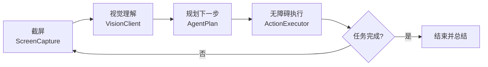

<div align="center">


<br/>


# Orion

**通用 AI 手机操作助手 · 说一句话，它替你操作手机**

[](https://www.android.com/)
[](https://kotlinlang.org/)
[](https://developer.android.com/jetpack/compose)
[](LICENSE)
[]()

</div>

---

## 这是什么

Orion 把手机变成会自己动手的助手。

你只需要说一句话，它就能**看懂屏幕、想清楚下一步、再模拟真实的点击与滑动**，一步一步把事做完。

它的思路很朴素，就像一个人在用手机：**看一眼 → 想一想 → 动一下 → 再看一眼**。循环往复，直到任务完成。

> 例：*「打开美团，搜一下附近评分最高的川菜馆」* —— 剩下的交给 Orion。

---

## 它能做什么

| 能力 | 说明 |
| --- | --- |
| 看懂屏幕 | 截图交给多模态大模型，识别当前是哪个 App、哪一页、该点哪里 |
| 替你动手 | 通过无障碍服务执行点击、长按、滑动、滚动、文字输入、返回 / 回桌面 / 多任务 |
| 实时解说 | 每一步的「想法」和进度，实时显示在灵动岛（实况通知）上 |
| 随时可控 | 一键暂停 / 停止，停止立即生效；碰到付款、下单等操作会先停下来问你 |
| 模型可换 | 内置豆包视觉、Qwen-VL，也支持任意 OpenAI 兼容的视觉模型 |
| 密钥加密 | API Key 用 `EncryptedSharedPreferences` 加密落盘，密钥托管在 Android Keystore |
| 自定义提示词 | 追加自己的做事习惯，例如「涉及付款先停下来问我」 |

---

## 它是怎么干活的

<div align="center">

</div>

引擎是一个不断收敛的循环：**截屏 → 视觉理解 → 规划 → 执行 → 等待 → 再截屏**。



一个任务的每一步，AI 都会输出一段 `thought`（它在想什么）和一个 `action`（它要做什么），二者都会写进首页时间线。

---

## 灵动岛：实时显示它的想法

<div align="center">

</div>

任务一旦开始，实况通知（Android 16 Live Updates / 灵动岛）会常驻显示**当前进度**、**AI 的实时解说**和**正在执行的动作**。不用一直盯着 App，扫一眼就知道它干到哪了。

---

## 支持的动作

模型输出的动作统一使用 **0~1000 的归一化坐标**，与屏幕分辨率解耦，落地时再按真实分辨率换算。

| `type` | 含义 |
| --- | --- |
| `tap` / `click` | 点击坐标 |
| `long_press` | 长按（300~3000ms） |
| `swipe` / `drag` | 滑动 / 拖拽 |
| `scroll` | 按方向滚动 |
| `input_text` / `input` | 在输入框里输入文字 |
| `open_app` | 打开指定 App |
| `back` / `home` / `recents` | 返回 / 回桌面 / 多任务 |
| `wait` | 等待画面加载 |
| `finish` | 任务结束并给出总结 |

---

## 快速开始

### 环境要求

- Android **13 (API 33)** 及以上
- 编译需要 **JDK 17**（AGP 8.13 + Kotlin 2.x）
- 一个可用的视觉模型 API Key

### 编译

```bash
git clone https://github.com/XIAWAN-PROMAX/Orion.git
cd Orion

# 沙箱 / CI 里默认 JDK 可能过新，显式指定 17
./gradlew assembleDebug -Dorg.gradle.java.home=$JAVA_HOME_17
```

产物：`app/build/outputs/apk/debug/app-debug.apk`

### 首次使用

1. 安装并打开 App，跟随新手引导。
2. **开启无障碍服务** —— 这是 Orion 的「手」。
3. **授权截屏**（MediaProjection）—— 这是 Orion 的「眼」。
4. **允许通知** —— 用来显示灵动岛实况通知。
5. 到「设置」里选好模型、填入 API Key，点「测试连接」。
6. 回到首页，说出你的指令，开始。

---

## 支持的模型

三者都是 **OpenAI 兼容的 `POST {baseUrl}/chat/completions`** 接口，一套代码通吃。

| 供应商 | 默认 Base URL | 默认模型 |
| --- | --- | --- |
| 豆包视觉 · 火山方舟 | `https://ark.cn-beijing.volces.com/api/v3` | `doubao-1.5-vision-pro-32k` |
| 通义千问 Qwen-VL · 阿里云百炼 | `https://dashscope.aliyuncs.com/compatible-mode/v1` | `qwen-vl-max-latest` |
| 自定义 | 自行填写 | 任意 OpenAI 兼容视觉模型（如 `gpt-4o`、自建网关） |

> 想接入新的模型供应商，只需在 `ModelProvider` 枚举里加一项，其余代码无需改动。

---

## 隐私与安全

- **API Key 加密存储**：使用 `EncryptedSharedPreferences`（AES256-SIV / AES256-GCM），主密钥由 Android Keystore 保管；若设备不支持，会自动降级并在设置页提示。
- **截图默认不落盘**：屏幕截图只在内存中处理后发给你所选的模型服务；可在设置里按需开启本地留存，方便排查。
- **数据去向由你决定**：Orion 只与你配置的模型服务通信，不经过任何第三方服务器。

---

## 技术栈

- **Kotlin** + **Jetpack Compose**（Material 3）
- **AccessibilityService** — 执行手势与文本输入
- **MediaProjection** — 屏幕捕获（前台服务）
- **Coroutines** — 任务编排与取消
- **androidx.security-crypto** — 加密偏好存储
- AGP 8.13 · compileSdk 36 · minSdk 33 · target 36 · JDK 17

---

## 项目结构

```text
com.orion.assistant
├── engine/                 # 中枢：把「看 → 想 → 做」串起来
│   ├── TaskOrchestrator.kt     # 主循环，任务生命周期（启动/暂停/停止）
│   ├── VisionClient.kt         # 视觉模型调用（OpenAI 兼容）
│   ├── AgentAction.kt          # 动作模型与解析
│   ├── ActionExecutor.kt       # 把动作落到屏幕上
│   └── OrionPrompt.kt          # 系统提示词 + 用户自定义提示词
├── service/
│   ├── OrionAccessibilityService.kt   # 「手」：手势 / 输入 / 全局动作
│   └── ScreenCaptureService.kt        # 「眼」：持 MediaProjection 的前台服务
├── notify/                 # 灵动岛实况通知
├── data/                   # 设置与历史（加密存储）
└── ui/                     # Compose 界面（首页 / 设置 / 历史 / 引导）
```

---

## 注意事项

Orion 会**真的替你操作手机**。它并不完美，也可能点错地方。

- 建议初次使用时从简单、可逆的任务开始（打开 App、搜索、翻页）。
- 涉及**付款、下单、发送消息**等不可逆操作时，请务必盯住屏幕，确认后再继续。
- 请遵守各 App 的服务条款，不要用它进行刷单、抢购等违规操作。

---

## 许可证

本项目基于 **GNU General Public License v3.0** 发布，**不可商用**。详见 [LICENSE](LICENSE)。

<div align="center">

**Orion v1.0.0**

xiawan 开发

</div>
